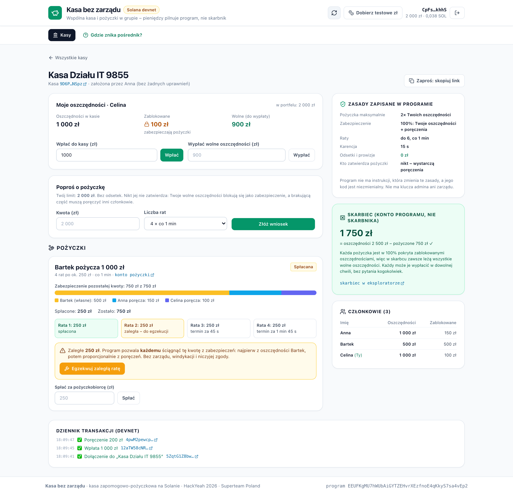

# Kasa bez zarządu 🐷

**A savings and loan fund with no board and no treasurer.** Members of a group (a team at work, a school, friends, a family) save together and lend each other money at 0%, like a Polish *kasa zapomogowo-pożyczkowa* (KZP). The money sits in an account owned by a Solana program instead of a treasurer's bank account. Loans need no approval: they pay out once members' locked savings cover them 100%. Overdue installments are collected from that collateral by anyone, with nobody's consent.

Built for the **Superteam Poland "Finance Without Intermediaries"** challenge at HackYeah 2026.

| | |
|---|---|
| Live app (Solana devnet, Polish UI) | https://web-production-ad49f.up.railway.app |
| Program (devnet) | [`EEUFKgMU7hWUbAiGYTZEHvrXEzfnoE4qKkyS7sa4vEp2`](https://explorer.solana.com/address/EEUFKgMU7hWUbAiGYTZEHvrXEzfnoE4qKkyS7sa4vEp2?cluster=devnet) (Anchor 1.1.2, IDL published on-chain) |
| Test złoty (tPLN) mint | [`3m9ZBm3NqJSRbMdCbnsB5fZWKxpk6tFWeU6PGhzcM8HG`](https://explorer.solana.com/address/3m9ZBm3NqJSRbMdCbnsB5fZWKxpk6tFWeU6PGhzcM8HG?cluster=devnet) (SPL Token, 2 decimals = grosze) |
| Recorded devnet run (every path, explorer links) | [docs/devnet-e2e.md](docs/devnet-e2e.md) |
| Pitch deck | [docs/pitch.pdf](docs/pitch.pdf) |
| Submission text | [SUBMISSION.md](SUBMISSION.md) |



## Who it is for

**Small groups in Poland that already pool money**: workplace KZPs (common in schools, public offices and factories), teams with a "kasa koleżeńska", friends and families who lend to each other. In this version they use a Solana wallet on devnet, so the first users are deliberately crypto-aware. The interface is in Polish and hides the chain: amounts in złoty, plain-language buttons, every program error explained in one sentence, explorer links only for those who want proof.

## The relationship we redesigned, and its intermediary

A KZP is mutual credit: members save every month and borrow from the common pot without interest; a borrower needs co-members to vouch for the loan (*poręczyciele*). It only works because of intermediaries:

- **the board (zarząd)** decides who gets a loan;
- **the treasurer** holds the money and the books;
- **the employer** deducts contributions and installments from salaries and chases defaulters.

Members have to trust them, and when that trust fails nobody can do anything about it: a PKZP treasurer from Jawor county embezzled 61,000 zł of colleagues' savings and lost it on a crypto exchange ([Puls Legnicy, 2024](https://pulslegnicy.pl/kryptowalutowa-afera-w-powiecie-jaworskim-skarbnik-ukradla-61-tys-zl-i-przegrala-je-na-gieldzie/41160/)); a PKZP cashier hid 261,510 zł of withdrawals with falsified cash reports for ten years ([Court of Appeal in Katowice, II AKa 98/15](https://www.saos.org.pl/judgments/175906)). Informal groups have it worse: "the kasa" is simply someone's private bank account. Since 2021 KZPs are regulated by the Act of 11 August 2021 on benefit-loan funds (Dz.U. 2021 poz. 1666), which still assumes a board, an audit committee and payroll deductions.

| | KZP / group kasa today | Kasa bez zarządu |
|---|---|---|
| Who holds the money | The treasurer (KZP bank account or a private one) | A token account owned by the program; only the rules can move it |
| Who approves loans | The board | Nobody. A loan pays out when locked savings (own + guarantors') cover 100% of it |
| Who collects installments | The employer's payroll, then the board | The program: once an installment is past due plus grace, **anyone** can trigger collection from collateral |
| Getting your savings back | Board decision, usually when leaving the job | Any time, for your unlocked savings, without asking |
| Changing the rules | General meeting or board | Impossible: no instruction edits a kasa's rules, no admin key |
| Interest and fees | 0% interest, admin effort | 0% interest, ~0.000005 SOL network fee |

## Why the fund can never lose

1. A loan can be paid out only when **locked savings cover 100% of it**: the borrower's own free savings first, then pledges from guarantors (up to 3).
2. Every repayment immediately **unlocks the same amount of collateral**, guarantors first (they are the last line of defence, so they leave first).
3. An overdue installment is **taken from the collateral**: the borrower's locked savings first, then guarantors pro rata. The tokens are already in the vault, so this is bookkeeping that needs no signature.
4. Therefore, always: **vault balance = Σ savings − Σ outstanding loans**, and every member's *free* savings are in the vault. Anyone can withdraw what is theirs at any moment; a run on the fund cannot fail. The LiteSVM tests assert this after every step, including a full bank run.

The only person who can lose money is a guarantor who chose to vouch for someone who then didn't pay. That is exactly the risk a *poręczyciel* takes in a KZP today, but now it is explicit, capped at the pledge, and visible to everyone.

```
request_loan ──► Pending ──(pledges reach 100%)──► disburse ──► Active ──repay / collect_overdue──► Repaid
 (own savings       │  guarantee / withdraw_guarantee                 │
  locked)           └─ cancel_loan ──► Cancelled (all unlocked)       └ installment k due at start + k·period,
                                                                         collectible by anyone after + grace
```

## Where exactly the intermediary disappears

All in `packages/contracts/programs/kasa/src/`:

| Rule that replaces the intermediary | Code |
|---|---|
| Money leaves the vault only through this function (callers: `withdraw`, `disburse`) | [`vault.rs:32`](packages/contracts/programs/kasa/src/vault.rs#L32) |
| No board: payout requires collateral = 100% of the loan, nothing else | [`instructions/loan.rs:247`](packages/contracts/programs/kasa/src/instructions/loan.rs#L247) |
| No debt collector: overdue amount computed from the schedule and the clock, collectable by anyone | [`instructions/repay.rs:100`](packages/contracts/programs/kasa/src/instructions/repay.rs#L100) |
| Seizure order: borrower's savings first, then guarantors pro rata | [`collateral.rs:32`](packages/contracts/programs/kasa/src/collateral.rs#L32) |
| Every guarantor account must be passed and match the loan, so nobody can be skipped | [`collateral.rs:18`](packages/contracts/programs/kasa/src/collateral.rs#L18) |
| Free savings withdrawable at any time, without asking | [`instructions/member.rs:127`](packages/contracts/programs/kasa/src/instructions/member.rs#L127) |
| Rules fixed at creation; the founder is not checked by any later instruction | [`instructions/create_kasa.rs:40`](packages/contracts/programs/kasa/src/instructions/create_kasa.rs#L40) |
| Loan limit = multiple of savings, own savings locked first | [`instructions/loan.rs:42`](packages/contracts/programs/kasa/src/instructions/loan.rs#L42) |

## What if someone disappears halfway?

| Who goes silent | Where the money is | What happens |
|---|---|---|
| The borrower stops paying | Disbursed tokens are with the borrower; the collateral is locked in the vault | After each due date + grace, anyone calls `collect_overdue` and the installment is taken from the borrower's locked savings, then from guarantors. The fund ends whole. |
| A guarantor | Their pledge stays locked in the vault | Nothing to do: the pledge unlocks automatically as the loan is repaid. Their free savings remain withdrawable. |
| The founder | n/a | Nothing changes. The founder has no rights after creation. |
| We (the authors) and this website | In the program's vault | Nothing changes. The program and its IDL are on-chain; any client can build the transactions. |

## Who can do what

| Action | Who | Enforced by |
|---|---|---|
| Create a kasa and set its rules (1–5× loan multiple, up to 24 installments, period, grace) | Anyone, once per kasa | `create_kasa`; no instruction edits them later |
| Join, deposit, withdraw free savings | Any wallet, for itself | `join` (no approval), `deposit`, `withdraw` (≤ savings − locked) |
| Ask for a loan | A member without an open loan, up to multiple × savings | `request_loan` |
| Guarantee | Any other member, from their free savings, up to the uncovered part | `guarantee` (borrower can't guarantee own loan) |
| Pay out / cancel a pending loan | The borrower only | `has_one = borrower` |
| Repay | Anyone (also on someone's behalf) | `repay` |
| Collect an overdue installment | **Anyone**, after due date + grace | `collect_overdue` (no signer needed) |
| Change rules, freeze or move someone's savings | **Nobody, through any instruction (including us)** | No such instruction exists; see the upgrade-key caveat below |

**Can we, as authors, change anything after deployment?** Not through the program: it has no admin key and no instruction that touches funds or rules outside the logic above, so we cannot edit a kasa's rules or move anyone's savings. One trust point remains, and we state it plainly: on devnet the program's **upgrade authority is still our deploy key** (`DhFgUwnupHZphYhJ2qWmD7zfjNE2p8zyRDqFiXo2AxXw`), so we could deploy different code. We keep it during the hackathon to be able to fix bugs. Before real money it would go to a multisig of member representatives, or be removed for good with `solana program set-upgrade-authority --final`. Anyone can check the current state with `solana program show EEUFKgMU7hWUbAiGYTZEHvrXEzfnoE4qKkyS7sa4vEp2 --url devnet`.

## Why blockchain and not a regular database?

In a database the intermediary is whoever runs it: they can change a balance, hold back a withdrawal or "borrow" from the pot, which is exactly what happens in the cases above. Here the balance is a token account owned by the program, the rules are public code that no instruction can bypass, every member sees every operation in real time, and collection of an overdue installment needs no trusted server because anyone can trigger it. Solana makes this cheap enough for a monthly 100 zł contribution: a transaction confirms in under a second for a fraction of a cent.

## Why there is no arbiter (and why we did not build a marketplace)

We started from escrow for second-hand trades between strangers. Any escrow for physical goods needs someone to say whether the parcel arrived and what was in it: an arbiter or an oracle. An arbiter is still an intermediary; bonds that burn both sides' deposits remove the arbiter but punish the honest party too. So we chose a relationship where **every condition is visible on-chain** (deposits, balances, the schedule, the clock), and the program can enforce it alone. Lending fits that pattern, and the KZP is a form of it that many Polish workplaces already use.

## Repository layout

```
packages/
├── contracts/                        Anchor 1.1.2 workspace
│   ├── programs/kasa/src/
│   │   ├── lib.rs                    instruction entrypoints
│   │   ├── state.rs                  Kasa, Member, Loan accounts
│   │   ├── math.rs                   installment schedule, pro-rata split (unit-tested)
│   │   ├── collateral.rs             lock / release / seize collateral
│   │   ├── vault.rs                  the only code that moves tokens in and out
│   │   └── instructions/             create_kasa, member (join/deposit/withdraw),
│   │                                 loan (request/guarantee/cancel/disburse), repay (repay/collect_overdue)
│   └── programs/kasa/tests/kasa.rs   9 LiteSVM tests with the real SPL Token program
└── web/                              Next.js 16 app (Polish UI)
    ├── idl/kasa.json                 IDL from the program build
    ├── src/generated/                typed Kit client generated by Codama
    ├── src/lib/                      schedule math mirrored from the program, instruction builders, chain reads
    ├── src/components/               kasa list, kasa view, loan card, explainer
    ├── src/app/api/faucet/route.ts   test-złoty faucet (devnet only, see limitations)
    ├── scripts/                      devnet e2e, Playwright UI e2e, burner wallets, Codama codegen
    └── tests/kasa.test.ts            unit tests: the UI's math matches the program's
docs/                                 devnet run log, screenshots, pitch, demo runbook, video script
```

There is **no database and no backend that decides anything**. The UI reads every kasa, member and loan with `getProgramAccounts` and sends transactions signed by the user's wallet. The only server code is the faucet for test złoty.

## Run it

Requirements: Node ≥ 20.18; for the program also Rust 1.89, Solana CLI 3.1.x and Anchor 1.1.2.

```bash
# Web app against the deployed devnet program
cd packages/web
npm install
cp .env.example .env.local      # a dedicated devnet RPC is recommended; FAUCET_SECRET_KEY enables the faucet
npm run dev                      # http://localhost:3000
```

Use Phantom, Solflare or Backpack on **devnet**. "Dobierz testowe zł" gives a wallet 2000 test złoty (and a little SOL for fees if it has none).

```bash
# Program: build + tests (LiteSVM loads target/deploy/kasa.so)
cd packages/contracts
anchor build
cargo test

# Web: unit tests, production build
cd packages/web
npm test
npm run build

# Devnet end-to-end with throwaway wallets (writes docs/devnet-e2e.md)
FUNDER_KEYPAIR=~/funded.json FAUCET_KEYPAIR=~/tpln-mint-authority.json npx tsx scripts/e2e-devnet.ts
# Real UI in headless Chromium with an injected Wallet Standard test wallet per member
npx tsx scripts/burners.ts fund && node scripts/ui-e2e.mjs https://web-production-ad49f.up.railway.app .e2e-wallets.json docs/screenshots
```

## What was verified

- **12/12 Rust tests**: 3 unit tests (schedule, pro-rata split) and 9 LiteSVM tests with the real SPL Token program: loan backed by guarantors paid out and repaid; overdue installments collected first from the borrower then guarantors by a transaction with no signer; partial repayment then default; withdrawing locked savings, exceeding the limit, guaranteeing your own loan, over-pledging, paying out an uncovered loan, collecting early, skipping or swapping guarantor accounts are all rejected; vault invariant after every step and a full bank run.
- **6/6 web unit tests**: the UI's schedule, overdue and split math return the same numbers as the program.
- **Devnet**: the full story in [docs/devnet-e2e.md](docs/devnet-e2e.md): kasa, deposits, a loan with two guarantors, one repayment, two collections by other members, rule-breaking attempts rejected, then everyone withdraws everything and the vault ends at 0.
- **UI**: Playwright drives three real browser sessions (Anna, Bartek, Celina) through create → join → deposit → request → guarantee → pay out → repay → collect overdue against the Railway deployment.

## Honest limitations

- **Test money.** On devnet there is no złoty, so a faucet mints test tPLN. It is the only server-side code and plays no role in the rules; the program accepts any SPL mint, so a real deployment would use a stablecoin (USDC/EURC, or a PLN stablecoin).
- **Wallet required.** Fine for crypto-aware groups, a barrier for a school KZP today (see roadmap).
- **Collection needs a trigger.** Overdue installments are collected when someone sends `collect_overdue`. Anyone can, and a bot could do it for free, but nothing happens on its own.
- **No forced contributions.** A real KZP requires monthly contributions; here saving is voluntary and the loan limit simply scales with what you saved.
- **Savings earn nothing**, as in a KZP (0% loans). Idle funds could be put to work, but that would add a counterparty.
- **Legal wrapper.** The Act on benefit-loan funds expects a statute, a board and an audit committee. The program can be the "engine" of such a fund; a fully board-less KZP would need the law to recognise it.
- **Clock.** Deadlines use the cluster clock, which on devnet runs a few seconds behind wall time; the UI uses the chain's clock for countdowns.
- **Upgrade key.** The program is still upgradeable by our deploy key (see "Can we change anything"). That is the one place where users must trust us today.
- **Not audited. Devnet only.** The RPC key in the public bundle is a free devnet key.

## If we had another week

1. **Standing orders without a bank**: SPL token delegation so installments and monthly contributions are pulled automatically, like payroll deductions today.
2. **Zapomogi** (grants) from a common fund, released by a member vote with a quorum fixed at creation.
3. A PLN stablecoin and a BLIK on-ramp; passkey wallets so a school KZP can use it without crypto knowledge.
4. A free public "collector" bot and notifications (email/push) before an installment is due.
5. Hand the upgrade authority to a members' multisig (or remove it), verifiable build and an audit; then mainnet.

## Stack

Anchor 1.1.2 · anchor-spl (SPL Token) · Solana CLI 3.1.10 · LiteSVM 0.10 · Codama · @solana/kit 8 + kit-plugin-wallet (Wallet Standard) · @solana-program/token · Next.js 16 · Tailwind · Playwright · deployed on Railway with a Helius devnet RPC.

**AI disclosure.** The project was built with an AI coding assistant (Claude Code) for implementation, tests and documentation; the design decisions and their reasoning are described above, and every claim here is backed by the tests and the devnet run.
